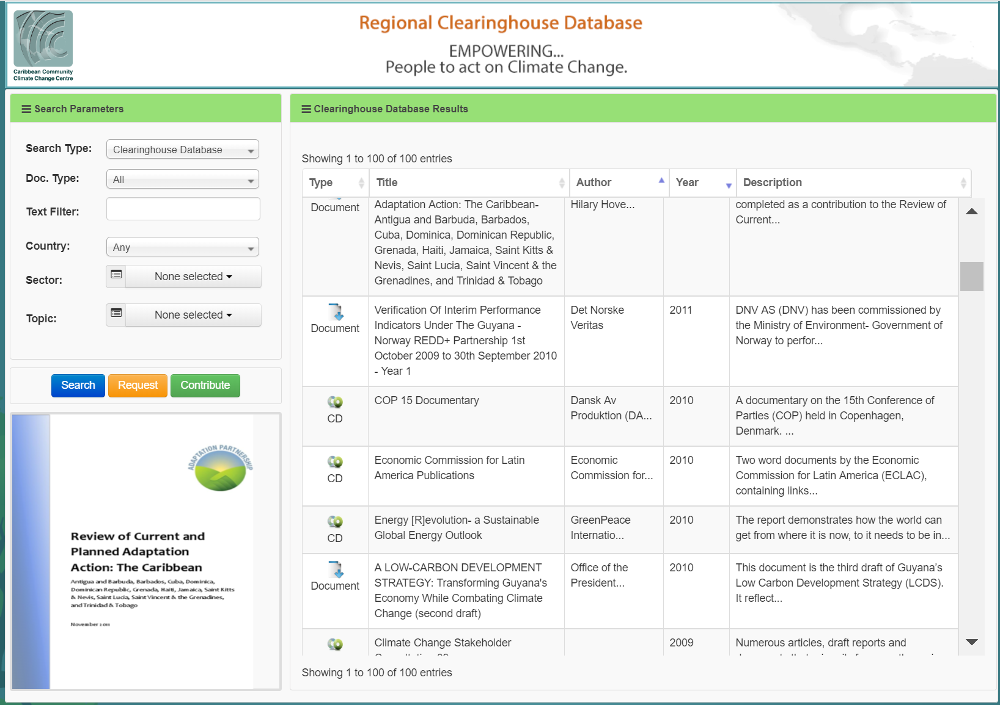
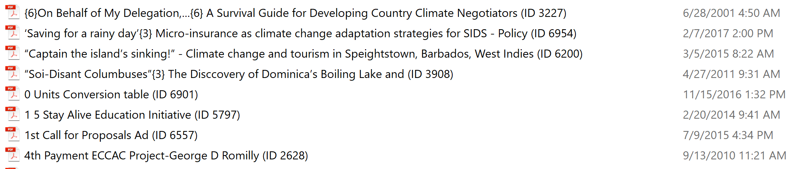
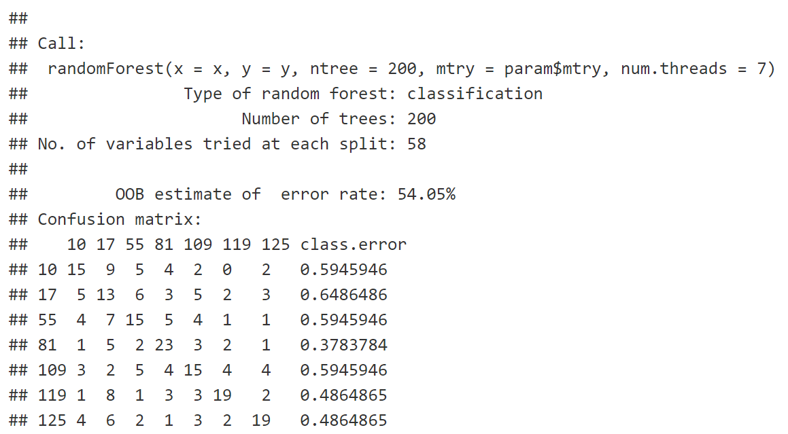

```{r setup, include=FALSE}
library("tidyverse")
library("splitstackshape")
library("tidytext")
library("stringr")
library("caret")
library("tm")
library("ggplot2")
library("DT")
library("pdftools")
set.seed(1100)
```


# Intro

<div id = "comment">

<strong>

The purpose of this project is to classify documents in the Caribbean Community Climate Change Center's Reginal Clearing house.

The official taxonomy contains 102 terms.

The focus was on the following topics in order to reduce storage and computational complexity.

    - 1100 Impacts of Climate  Change
    - 1200 Data and Observations
    - 1441 Policy Making
    - 1400 Adaptation
    - 1322 Renewable Energy
    - 1010 General on Climate Change
    - 1445 Water Resource Management


Random forests were used to classify the data.
</strong>

</div>


# Data Source

<div id = "comment">

<strong>The data was manually sourced and compiled from the Clearing house.</strong>

<strong>An Initial sample of 2650 documents were taken.</strong>

<strong>The corresponding metadata was sourced separately, due to software licensing constraints.</strong>



</div>


# Description Based Model

<div id = "comment">

Textual data is held in the `Description` field of the *metadata* file, and also in the actual PDF documents.

Both of these will be modeled separately.
</div>

## Load Data

```{r eval = TRUE}
#load consolidated data
descriptionData <- read.csv2('data/metadata.csv', sep=",", header = TRUE, stringsAsFactors = FALSE)

print(paste0("Number of variables: ",ncol(descriptionData)))
print(paste0("Number of observations: ",nrow(descriptionData)))
```

## Filter & Clean Data
```{r eval=TRUE}

descriptionData <- select(descriptionData, ID, Description, TopicID, Topic) %>%
  filter(!is.na(Description), Description != '',Description != '\n',!is.na(TopicID), TopicID != '') %>%
  mutate(Description = as.character(Description)) %>%
  cSplit("TopicID", sep = ";", direction = "long") %>%
  distinct(ID,Description, .keep_all = TRUE) %>%
  cSplit("Topic", sep = ";", direction = "long") %>%
  distinct(ID,Description, .keep_all = TRUE)
 
names(descriptionData) <-c("ID","Description","ClassID","Class")
print(paste0("Number of variables: ",ncol(descriptionData)))
print(paste0("Number of observations: ",nrow(descriptionData)))
```

** Preview Data
```{r}
datatable(head(descriptionData), options = list(filter = FALSE), filter = "none")
```


## Topic Distribution

```{r}
#Plot Distribution  
(descriptionData %>% 
   group_by(Class) %>% 
    summarise(Freq=n()) %>% 
    top_n(10) %>%
    ungroup() %>%  
ggplot(aes(x = reorder(Class,Freq), y = Freq,fill=Freq, label= `Freq`)) + 
    geom_bar(stat = "identity", show.legend = F) + 
    geom_text(size = 2, position = position_stack(vjust = 0.5)) + 
    coord_flip() +  
    labs(title = "Distribution of Topics (Top 10)", x = "Topic", y = "Frequency"))
```


## Sampling

<div id = "comment">

The data is highly unbalanced.

This will pose problems for ML algorithms, especially the Random Forest, that will be used for this project.

The data set will be down sampled using the *downsample* function.

</div>


```{r eval=TRUE}

l <- c(109,81,10,119,17,125,55)
ll <- c("Impacts of Climate Change", 
                             "Data and Observations",
                             "Policy Making",
                             "Adaptation",
                             "Renewable Energy", 
                             "General on Climate Change", 
                             "Water Resource Management")
mlData <- filter(descriptionData, ClassID %in% l) %>%
            mutate(ClassID = factor(ClassID))

#levels(mlData$ClassID) <- ll
down_train <- downSample(mlData,mlData$ClassID,list = TRUE) 
 
mlData <- down_train$x
 
mlData <- mlData[sample(1:nrow(mlData)), ]
 
mlDataTrain <- mlData 

nTrain = ceiling(nrow(mlData) * 0.70)

mlDataTrain <-mlData[c(1:nTrain),]

mlDataTest <- mlData[c((nTrain + 1):nrow(mlData)),] 

print(paste0("Observations in training set: ",nrow(mlDataTrain)))

print(paste0("Observations in test set: ",nrow(mlDataTest)))
```


## Create Tidy Data Frame

```{r eval=TRUE}
data_tokens <- mlDataTrain %>%
  
   #create tidy data frame and converts words to lower case
   unnest_tokens(output = word, input = Description) %>% 
   # remove numbers
   filter(!str_detect(word, "^[0-9]*$")) %>%
   # remove stop words
   anti_join(stop_words) %>%
   # stem the words (derivations of words are mapped )
   # eg. possibly = possible
   mutate(word = SnowballC::wordStem(word))

datatable(head(data_tokens), options = list(filter = FALSE), filter = "none")
```


## Create Document-Term Matrix

<div id = "comment">
Both TF & TF-IDF were tested
</div>

```{r eval=TRUE}
data_dtm <- data_tokens %>%
   # get count of each token in each document
   count(ID, word) %>%
   
   cast_dtm(document = ID, term = word, value = n
            ,weighting = tm::weightTfIdf
            )

data_dtm
```


```{r eval=FALSE}
data_dtm <- removeSparseTerms(data_dtm, sparse = .90)
```

## Exploratory Analysis

** Create TFIDF for plotting **

```{r eval=TRUE}
data_tfidf <- data_tokens %>%
   count(ClassID, word) %>%
   bind_tf_idf(word, ClassID, n)
```

```{r eval=FALSE}

plot_data <- data_tfidf %>%
  arrange(desc(tf_idf)) %>%
  mutate(word = factor(word, levels = rev(unique(word))))
  
plot_data %>%
  filter(ClassID %in% l) %>%
  mutate(ClassID = factor(ClassID, levels=l,
                        labels = ll)) %>%
  group_by(ClassID) %>%
  top_n(5) %>%
  ungroup() %>%
  ggplot(aes(word, tf_idf)) +
  geom_col() +
  labs(title = "Influencial Words by Topic", x = NULL, y = "IF-IDF") +
  facet_wrap(~ClassID, scales = "free") +
  coord_flip()
```


## Train Description Random Forest

```{r eval=FALSE}
set.seed(1001)

system.time({
  RF_Traineds <- train(x = as.matrix(data_dtm),
                       y = factor(mlDataTrain$ClassID),
                       method = "rf",
                       ntree = 1000,
                       num.threads = 7,
                       trControl = trainControl(method = "oob"))
})

RF_Traineds$finalModel
```

## The Results


<div id = "comment">

As we can see, the model based on the description didn't perform well at all, even with the long wait of 1000 trees.

Let's see how the Random Forest on actual PDF contents performs.
</div>

# PDF Content Based Model

## Load PDF Data

<div id = "comment"> 
The corpus contained 14 Gb of data.

This data need to be loaded into the dataframe containing the the metadata.
</div>


## Rename Files





<div id = "comment">
The file names included title text with the document ID embedded.

These files must be extracted and renamed based on its ID.
</div>

```{r eval=FALSE}

	for(i in 1:nrow(descriptionData)){
     if(descriptionData$ID[i] > 1000){
        doc <- list.files(path = "data/corpus/", pattern = paste0(descriptionData$ID[i],").pdf$"),full.names = TRUE)
        if(length(doc) > 0){
          new_name <- paste0("data/corpus/",descriptionData$ID[i],".pdf")
          print(new_name)
          file.rename(doc[1],new_name)
        }
     }
    
  }
  
```

## Clean & Load Contents into Dataframe

```{r eval=FALSE}

data2$Content <- rep("",nrow(data2))
for(i in nrow(mlData2):1){
  
  doc <- paste0("data/corpus/",mlData2$ID[i],".pdf")
  if(file.exists(doc)){
    content <- pdftools::pdf_text(doc)
      content <- paste(content, collapse = ' ')
      content <- str_replace_all(content, "[\r\n]", " ")
      content <- str_replace_all(content, "[[:punct:]]", " ")
      content <- str_replace_all(content, "[[:digit:]]", " ")
      content <- str_replace_all(content, ",", " ")
      content <- str_replace_all(content, "<", " ")
      content <- str_replace_all(content, ">", " ")
      data2[which(data2$ID==mlData2$ID[i]),]$Content <- content
    
  }
  
}

write.csv(select(data2,ID,ClassID,Content),file="data/pdf_contents.csv",quote = TRUE )

```

## Prepare Data for Modeling
```{r eval = TRUE}
#load consolidated data
contentData <- read.csv2('data/pdf_contents.csv', sep=",", header = TRUE, stringsAsFactors = FALSE)

print(paste0("Number of variables: ",ncol(contentData)))
print(paste0("Number of observations: ",nrow(contentData)))
```


```{r eval=TRUE}

l <- c(109,81,10,119,17,125,55)
ll <- c("Impacts of Climate Change", 
                             "Data and Observations",
                             "Policy Making",
                             "Adaptation",
                             "Renewable Energy", 
                             "General on Climate Change", 
                             "Water Resource Management")
mlData <- filter(contentData, ClassID %in% l) %>%
            mutate(ClassID = as.integer(ClassID))  %>%
            mutate(ClassID = factor(ClassID))
            

#levels(mlData$ClassID) <- ll
down_train <- downSample(mlData,mlData$ClassID,list = TRUE) 
 
mlData <- down_train$x
 
mlData <- mlData[sample(1:nrow(mlData)), ]
 
mlDataTrain <- mlData 

nTrain = ceiling(nrow(mlData) * 0.70)

mlDataTrain <-mlData[c(1:nTrain),]

mlDataTest <- mlData[c((nTrain + 1):nrow(mlData)),] 

print(paste0("Observations in training set: ",nrow(mlDataTrain)))

print(paste0("Observations in test set: ",nrow(mlDataTest)))
```


## Create Tidy Data Frame

```{r eval=TRUE}
data_tokens <- mlDataTrain %>%
  
   #create tidy data frame and converts words to lower case
   unnest_tokens(output = word, input = Content) %>% 
   # remove numbers
   filter(!str_detect(word, "^[0-9]*$")) %>%
   # remove stop words
   anti_join(stop_words) %>%
   # stem the words (derivations of words are mapped )
   # eg. possibly = possible
   mutate(word = SnowballC::wordStem(word))

datatable(head(data_tokens), options = list(filter = FALSE), filter = "none")
```


## Create Document-Term Matrix

```{r eval=TRUE}
data_dtm <- data_tokens %>%
   # get count of each token in each document
   count(ID, word) %>%
   
   cast_dtm(document = ID, term = word, value = n
            #,weighting = tm::weightTfIdf
            )

data_dtm
```


```{r eval=FALSE}
data_dtm <- removeSparseTerms(data_dtm, sparse = .90)
```

## Exploratory Analysis

** Create TFIDF for plotting **

```{r eval=TRUE}
data_tfidf <- data_tokens %>%
   count(ClassID, word) %>%
   bind_tf_idf(word, ClassID, n)
```

```{r eval=FALSE}

plot_data <- data_tfidf %>%
  arrange(desc(tf_idf)) %>%
  mutate(word = factor(word, levels = rev(unique(word))))
  
plot_data %>%
  filter(ClassID %in% l) %>%
  mutate(ClassID = factor(ClassID, levels=l,
                        labels = ll)) %>%
  group_by(ClassID) %>%
  top_n(5) %>%
  ungroup() %>%
  ggplot(aes(word, tf_idf)) +
  geom_col() +
  labs(title = "Influencial Words by Topic", x = NULL, y = "IF-IDF") +
  facet_wrap(~ClassID, scales = "free") +
  coord_flip()
```


## Train Content Random Forest

```{r eval=FALSE}
system.time({
  RF_Traineds <- train(x = as.matrix(data_dtm),
                       y = factor(mlDataTrain$ClassID),
                       method = "rf",
                       ntree = 200,
                       num.threads = 7,
                       trControl = trainControl(method = "oob"))
})

RF_Traineds$finalModel
```

## The Updated Model Results



<div id = "comment">

While the performance is much better, it is not quite ready for production.

There seems to be issues with the original classifications of the data.
</div>

### Conclusion

<div id = "conclusions">
After investigations it was found that the likely reasons for the poor performance of the models are:

    - Non-standard document tagging practices
    - Limited computing resources (laptop)
    
The main issue stems from the fact that the same documents are tagged with the parent topic, and also with the child topics. This is likely to confuse the
Random Forest at the splits. It would have been best to only select child topics, but use the parental topics as tags.
     
It is recommended to do a through review of the document tagging strategy. This has always been placed on the back-burner!


The garbage in garbage out rule also applies to "smart" algorithms!


This has been a challenging but fruitful exercise, Thanks to DATA 607, I have learnt the skills necessary to think like a data scientist!

</div>


